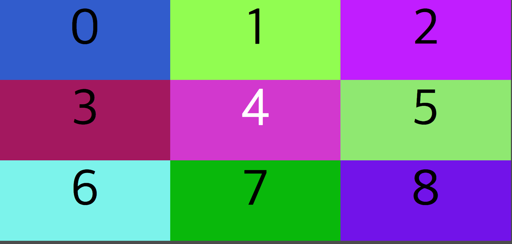

# Maui-widget

Maui-widget는 기존에 MayUHD-widget 이 **고도화된** Widget Library 이며, Redlab에서 개발되고 있는 차세대 양방향 하이브리드 OTT 에서 등록해서 사용할 수 있는 Library 입니다.


#### Using mayui-wdiget

- Import

  - html import

    ```html
    <script src="https://cdn.jsdelivr.net/npm/may-widget/maui-widget.min.js" type="text/javascript"></script>
    <!-- OR -->
    <script src="maui-widget.js"></script>
    ```

  - ECMA6

    ```javascript
    // your index.js
    import mauiWidget from 'maui-widget'
    ```

- Methods
  - addEventListener(type:string, callback:fcuntion)

    ```javascript
    /**
     * keyDown Event
     */
    $mw.addEventListener("keydown", function (e) {
    });
    /**
     *  keyUp Event
     */
    $mw.addEventListener("keyup", function (e) {
    });
    /**
     *  Video Play 
     */
    $mw.addEventListener('video.play', function () {
    });
    /**
     *  Video Error
     */
    $mw.addEventListener('video.error', function () {
    });
    /**
     *  Video Eended / finish
     */
    $mw.addEventListener('video.finish', function () {
    });
    ```

  - removeEventListener(type:string, callback:fcuntion)

  - video

    - videoPlay(url:string)
    - videoStop
    - videoResume
    - videoPause
    - videoGetCurrentTime(callback:function)
    - videoSetCurrentTime
    - videoGetDuration(callback:function)

    ```javascript
    /**
     * Video Play
     * @param {string} url
     */
    $mw.videoPlay('http://clips.vorwaerts-gmbh.de/VfE_html5.mp4');
    /**
     * Video Pause
     */
    $mw.videoPause();
    /**
     * Video Resume
     */
    $mw.videoResume();
    /**
     * Video Stop
     */
    $mw.videoStop();
    /**
     * Get Current Time Video
     * @param {function} time callback
     */
    $mw.videoGetCurrentTime(function (time) {
        console.log('video time', time);
    });
    /**
     * Set Current Time Video
     * @param {number} set duration
     */
    $mw.videoSetCurrentTime(50);
    /**
     * Get Duration Video
     * @param {function} duration - time
     */
    $mw.getDuration(function (duration) {
        console.log('video duration', duration);
    })
    ```

    ​


#### Remote Control Key

keyboard에 event 로 받을 수 있는 type은 keydown, keyup 2가지가 있습니다. 또한 W3C 규격으로 keyBoard Event 를 받을 수 있습니다.

현재는 maui.js(고도화 된 라이브러리) 또는 mayuhd-driver.js 받아 Project 에 import 해서 사용할 수 있습니다.
document, window에 직접 Event Listener 를 추가하는 것은 Error 가 인식이 안되는 현상이 있습니다.

- KeyEvent 등록 방법

  - MayUHD / maui

    ```javascript
    $mw.addEventListener("keydown", function (e) {
        const keyCode = e.keyCode;
    	console.log(keyCode);
    });
    $mw.addEventListener("keyup", function (e) {
        const keyCode = e.keyCode;
        console.log(keyCode);
    });
    ```

    ​

- 리모컨 지원항목

  - HiTV

    | Key         | 기능               | key code |
    | ----------- | ---------------- | -------- |
    | MEDIA_RED   | 확장 기능을 사용할 경우 사용 | 183      |
    | MEDIA_GREEN | 확장 기능을 사용할 경우 사용 | 184      |
    | MEDIA_YELLO | 확장 기능을 사용할 경우 사용 | 185      |
    | MEDIA_BLUE  | 확장 기능을 사용할 경우 사용 | 186      |
    | BACK        | 뒤로가기             | 27       |
    | DPAD_UP     | 위                | 38       |
    | DPAD_LEFT   | 왼쪽               | 37       |
    | OK          | 확인(Enter)        | 13       |
    | DPAD_RIGHT  | 오른쪽              | 39       |
    | DPAD_DOWN   | 아래               | 40       |
    | NUMBER_1    | 숫자 1             | 49       |
    | NUMBER_2    | 숫자 2             | 50       |
    | NUMBER_3    | 숫자 3             | 51       |
    | NUMBER_4    | 숫자 4             | 52       |
    | NUMBER_5    | 숫자 5             | 53       |
    | NUMBER_6    | 숫자 6             | 54       |
    | NUMBER_7    | 숫자 7             | 55       |
    | NUMBER_8    | 숫자 8             | 56       |
    | NUMBER_9    | 숫자 9             | 57       |
    | NUMBER_0    | 숫자 0             | 48       |
    | BACKSPACE   | backspace        | 27       |

    ​

### 

## Example Code

1. 바둑판 배열 키보드이동
   * 경로 : example/public/index.html
   * 미리보기
   * 

```html
<!DOCTYPE html>
<html lang="en">

<head>
    <meta charset="UTF-8">
    <meta name="viewport" content="width=device-width, initial-scale=1.0, minimum-scale=1.0, maximum-scale=1.0, user-scalable=no">
    <meta http-equiv="X-UA-Compatible" content="ie=edge">
    <title>Document</title>
    <style>
        body {
            background: rgba(0, 0, 0, .7);
            padding: 0;
            margin: 0;
        }

        #box-container {
            display: block;
            padding: 0;
            margin: 0;
        }

        #box-container>.box {
            text-align: center;
            align-items: center;
            float: left;
            height: 300px;
            width: 33%;
            padding: 20px;
            font-size: 12rem;
            padding: 0;
            margin: 0;
        }

        .box.focus {
            color: white;
        }
    </style>
</head>

<body>
    <div id="box-container">
    </div>
    <script src="https://cdn.jsdelivr.net/npm/may-widget/maui-widget.min.js" type="text/javascript"></script>
    <script>
        (function () {
            const b = document.getElementById('box-container');
            const max = 9;
            var index = 0;
            for (var i = 0; i < max; i++) {
                var box = document.createElement('DIV');
                box.className = 'box';
                box.innerText = i;
                box.style = 'background-color:' + ('#' + Math.random().toString(16).substr(-6));
                b.appendChild(box);
            }
            b.childNodes[index + 1].setAttribute('class', 'box focus');

            function moveBoxByIndex(keyCode) {
                if (keyCode < 37 || keyCode > 40) {
                    return index;
                }
                b.childNodes[index + 1].setAttribute('class', 'box');
                if (keyCode === 37) {
                    index -= 1;
                } else if (keyCode === 38) {
                    index -= 3;
                } else if (keyCode === 39) {
                    index += 1;
                } else if (keyCode === 40) {
                    index += 3;
                }
                if (index < 0) {
                    index = 0;
                } else if (index >= max) {
                    index = max - 1;
                }
                b.childNodes[index + 1].setAttribute('class', 'box focus');
                return index;
            }

            $mw.addEventListener("keydown", function (e) {
                const keyCode = e.keyCode;
                moveBoxByIndex(keyCode);
            });

            $mw.addEventListener("keyup", function (e) {
                const keyCode = e.keyCode;
            });
        }());
    </script>
</body>

</html>
```


------

## 향후 업데이트 예정

- [x] widget 에서 keyboard, video control


- [x] device info 가져오기
- [x] $MayUHD -> $maui 로 변경
- [ ] video duration 가져오기 및 비디오 에 미흡한 기능 추가
- [ ] 8VSB, QAM 재생
- [ ] package.json 추가 기능 정리


### 삭제된 항목

#### ~~Package.json~~

~~Launcher 에서 Widget App 을 실행하는데 기본 셋팅이며, 기본적으로 npm, package.json(https://docs.npmjs.com/files/package.jsonpacakge.json) 규격에 따릅니다.~~

~~package.json 신규 추가 항목~~

- ~~widgetType~~

  - ~~type : string~~

  - ~~Values~~

    | ~~구분~~              | ~~비고~~                                   |
    | ------------------- | ---------------------------------------- |
    | ~~page~~            | ~~full screen web app 이며, Menu 항목 또는 관리자(방송국)에서 설정할 경우, Launcher 가 실행 하자마자 maui(May-UI) 대신 실행할 수 있도록 할 수 있다.~~ |
    | ~~channel-web-app~~ | ~~Live 방송 Channel 항목에 방송 대신 web app 이 full screen 으로 표시할 수 있다. 예를 들어 300번 채널에 VOD 광고 widget 을 추가하고 싶을 경우, 300 번을 설정후 channel-web-app 으로 package.json 에 입력하면 된다.~~ |
    | ~~window~~          | ~~TV ticker 방식으로 화면에 노출되는 기능~~           |

- ~~userPermission~~

  - type : string-array 

  - ~~Values~~

    | ~~구분~~         | ~~비고~~                                   |
    | -------------- | ---------------------------------------- |
    | ~~video~~      | ~~Video(IP)를 control(play, pause, resume, stop, currentTime, duration) 한다.~~ |
    | ~~8VSB~~       | ~~8VSB 방송을 control 한다.~~                 |
    | ~~QAM~~        | ~~QAM 방송을 control 한다.~~                  |
    | ~~setting~~    | ~~OTT에 Setting 을 가져오거나 설정한다.~~           |
    | ~~deviceInfo~~ | ~~device 에 sn, mac 정보들을 가져온다.~~          |

  - ~~keyEvents~~

    - ~~type : integer-array~~
    - ~~Values : **https://developer.mozilla.org/en-US/docs/Web/API/KeyboardEvent/keyCode**~~

  - ~~runPattern~~

    - ~~**widgetType 중 window 만 해당되는 기능입니다.**~~
    - ~~type: string~~
    - ~~Values~~

    | ~~구분~~              | ~~비고~~                       |
    | ------------------- | ---------------------------- |
    | ~~routerURL~~       | ~~launcher 에 현재 경로에 따라서 실행~~ |
    | ~~categoryHistory~~ | ~~특정 카테고리 메뉴에 도달 했을때 실행~~    |


- ~~**Example package.json**~~

  ```json
  {
     "name": "sample-widget",
     "version": "0.0.1",
     "description": "샘플 widget project",
     "main": "server.js",
     "scripts": {
         "start": "node server.js"
     },
     "author": "donghyun, kim (Redlab)",
     "license": "ISC",
     "dependencies": {
         "babel-cli": "^6.26.0",
         "babel-preset-env": "^1.6.0",
         "body-parser": "^1.18.2",
         "express": "^4.15.5"
     },
     "devDependencies": {
         "nodemon": "^1.12.1"
     },
     "homepage": "http://127.0.0.1:4000",
     "widgetType": "fullPage",
     "usePermission": [
         "video",
         "deviceInfo"
     ],
     "keyEvents": [
         37,
         38,
         39,
         40,
         13,
         27
     ]
  }
  ```

  ​